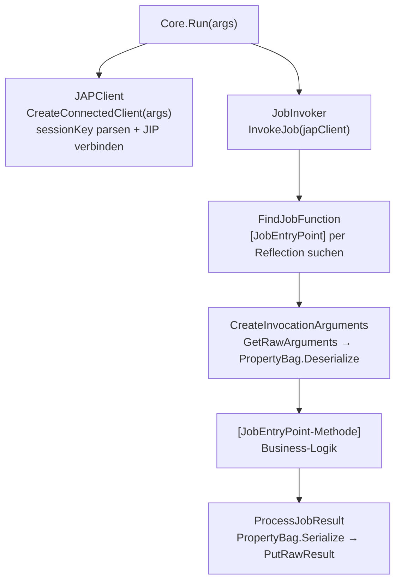

# JOSYN.JobHost

Part of the **JOSYN** (JobSystem Next) ecosystem — die Job-Entwickler-Bibliothek.

`JOSYN.JobHost` ist die **Job-Entwickler-Bibliothek**. Jede Job-Exe
verweist auf dieses Paket. Es übernimmt die IPC-Verbindung zum JAPServer, holt Job-Argumente
ab, dispatcht die Job-Methode per Reflection und sendet das Ergebnis zurück — alles über
das JOSYN-Result-Pattern.

---

## Motivation

Job-Executables sollen ausschließlich Business-Logik enthalten. Alles andere —
Verbindungsaufbau, Argument-Deserialisierung, Ergebnis-Serialisierung — erledigt diese
Bibliothek. Eine minimale Job-Exe reduziert sich auf eine Zeile `Program.cs`:

```csharp
return await JOSYN.JobHost.Core.Run(args);
```

Der Job-Autor markiert genau eine `public static`-Methode mit `[JobEntryPoint]` —
den Rest übernimmt die Laufzeit.

---

## Schnellstart

### 1 — Job-Exe (`Program.cs`)

```csharp
return await JOSYN.JobHost.Core.Run(args);
```

### 2 — Job-Implementierung

```csharp
using JOSYN.JobHost.Attributes;

public static class MeinJob
{
    [JobEntryPoint]
    public static MeinErgebnis Ausführen(MeinArgument args)
    {
        return new MeinErgebnis { Nachricht = "Echo: " + args.Text };
    }
}
```

Argument- und Ergebnistypen müssen `record`-Typen sein, die von
`JOSYN.Foundation.PropertyBag` unterstützt werden.

---

## Architektur



**Transport:** `JOSYN.Foundation.JIP` Named Pipes (session-isoliert per GUID-Key).
**Anwendungsprotokoll:** `JOSYN.Jap.Shared.Contract.IJosynApplicationProtocol`.
**Serialisierung:** `JOSYN.Foundation.PropertyBag` (INI oder JSON, auto-erkannt).

---

## Attribute-Referenz

| Attribut | Ziel | Zweck |
|---|---|---|
| `[JobEntryPoint]` | Methode | Markiert die einzige Job-Entry-Methode. Genau eine pro Assembly. |
| `[BeforeJobEntryPoint]` | Methode | Läuft vor dem Job; für Setup / Parallel-Execution-Prüfungen. |
| `[JobArguments]` | Klasse | Markiert einen Typ als Job-Argument-Typ. |
| `[JobResult]` | Klasse | Markiert einen Typ als Job-Ergebnis-Typ. |
| `[ParallelExecutionAllowed(bool)]` | Methode | Deklariert, ob der Job parallel ausgeführt werden darf. |

---

## Exit-Codes

| Code | Bedeutung |
|---|---|
| `0` | Job erfolgreich abgeschlossen |
| `-1` | IPC-Verbindung fehlgeschlagen (Server nicht erreichbar) |
| `-2` | Job-Aufruf fehlgeschlagen (Laufzeit- oder Business-Fehler) |

### Fehler-Routing

```
Pipe-Verbindungsfehler          →  LocalLog.Error(...)              (nur lokal)       Exit -1
Job-Fehler, Pipe noch aktiv     →  LocalLog.Error(...) + PutError   (lokal + remote)  Exit -2
PutError selbst fehlgeschlagen  →  LocalLog.Error(...)              (Fallback lokal)  Exit -2
```

---

## Abhängigkeiten

| Paket | Rolle |
|---|---|
| `JOSYN.Foundation.ResultPattern` | Fehler-als-Wert-Pattern durchgängig |
| `JOSYN.Foundation.JIP` | Named-Pipe-IPC-Transport |
| `JOSYN.Foundation.PropertyBag` | Argument- / Ergebnis-Serialisierung |
| `JOSYN.Jap.Shared.Contract` | `IJosynApplicationProtocol`-Anwendungsprotokoll |
| `JOSYN.Jap.Shared.Log` | `LocalLog` für Fehlerprotokollierung |

---

## Für Maintainer

### Bauen, Testen, Packen

```
.local-build\build.cmd          # Release-Build
.local-build\build.cmd Debug    # Debug-Build
.local-build\test.cmd           # Alle Tests ausführen
.local-build\pack.cmd           # NuGet-Paket → ..\..\Local Packages\
```

### Hinweise

- **Genau ein `[JobEntryPoint]` pro Assembly** — die Laufzeit meldet einen Fehler, wenn
  null oder mehr als einer gefunden werden.
- **Reflection ist bewusst eingesetzt** — `JobInvoker` nutzt `Assembly.GetEntryAssembly()`
  um die Job-Methode zu lokalisieren. Das ist der definierte Erweiterungs-Punkt; kein DI-Wiring.
- **`JAPClient` ist `internal`** — implementiert `IJosynApplicationProtocol` via JIP-Transport.
- **`ArgumentsComparer<T>`** — internes Delegate, bewusster Platzhalter für zukünftigen
  bedingten Parallel-Execution-Feature. Nicht entfernen.
- **Fehlermeldungen sind auf Deutsch** — projekt-weite Konvention.
- **`de-DE` Default-Kultur** — betrifft Zahlen- und Datumsformatierung in PropertyBag.
